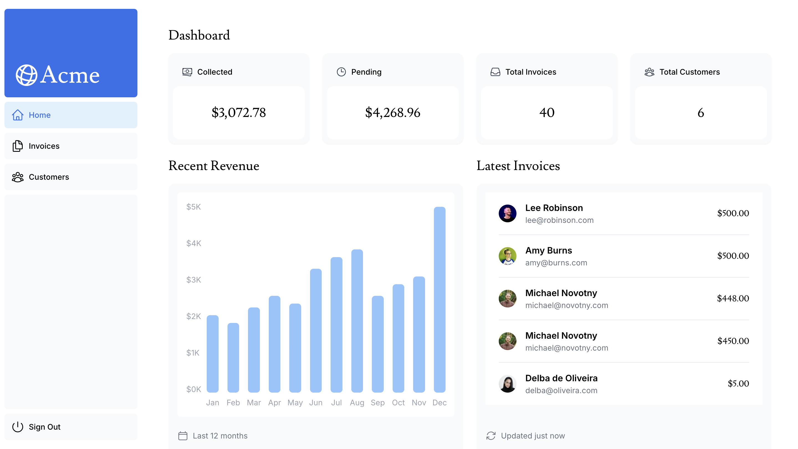
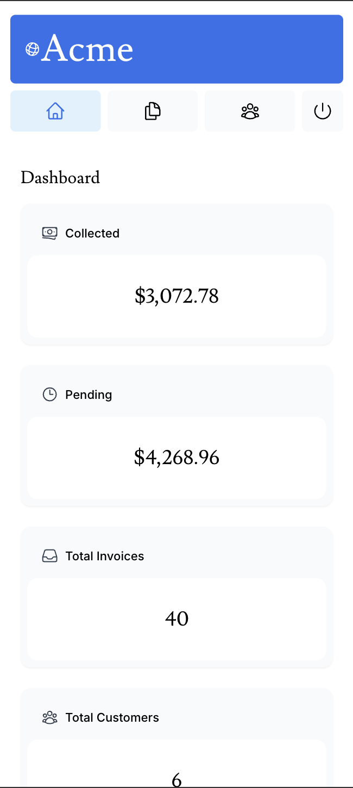

# Acme Dashboard

This project is a **Next.js-based dashboard application** inspired by the Acme Dashboard example from the Next.js official website. It provides a modern, responsive, and dynamic interface for managing and visualizing key metrics and data.

### Live Demo
You can check out the live version of the application at [https://nextjs-dashboard-psi-flame-93.vercel.app](https://nextjs-dashboard-psi-flame-93.vercel.app/).

## Features

- **Fast and Scalable**: Built using Next.js for server-side rendering and static site generation.
- **Dynamic Dashboards**: Interactive and customizable dashboards.
- **Responsive Design**: Fully optimized for desktop and mobile devices.
- **Data Fetching**: Uses Next.js API routes and static generation with revalidation.
- **Built-In Authentication**: Secure user authentication with session management.

## Tech Stack

- **Frontend**: [Next.js](https://nextjs.org/), TypeScript
- **Styling**: Tailwind CSS
- **Authentication**: NextAuth.js

## Installation

Follow these steps to set up the project locally:

### Prerequisites

- Node.js (>= 16.x)
- npm or yarn

### Steps

1. Clone the repository:
   ```bash
   git clone https://github.com/srivishnu25/nextjs-dashboard.git
   cd acme-dashboard
   ```

2. Install dependencies:
   ```bash
   npm install
   # or
   yarn install
   ```

3. Create a `.env.local` file for environment variables:
   ```
   AUTH_GITHUB_ID={CLIENT_ID}
   AUTH_GITHUB_SECRET={CLIENT_SECRET}
   AUTH_GOOGLE_ID={CLIENT_ID}
   AUTH_GOOGLE_SECRET={CLIENT_SECRET}
   ```

4. Run the development server:
   ```bash
   npm run dev
   # or
   yarn dev
   ```

5. Open [http://localhost:3000](http://localhost:3000) to view the app in the browser.

## Scripts

- `npm run dev`: Start the development server
- `npm run build`: Build the application for production
- `npm run start`: Start the production server
- `npm run lint`: Run ESLint checks

## Contributing

Contributions are welcome! Please follow these steps:

1. Fork the repository.
2. Create a feature branch:
   ```bash
   git checkout -b feature-name
   ```
3. Commit your changes:
   ```bash
   git commit -m "Add feature description"
   ```
4. Push the branch:
   ```bash
   git push origin feature-name
   ```
5. Open a Pull Request.

## License

This project is licensed under the MIT License. See the [LICENSE](LICENSE) file for details.

---

### Screenshots

#### Dashboard Overview


#### Responsive Design


---

Enjoy building with the **Acme Dashboard**! 🚀
